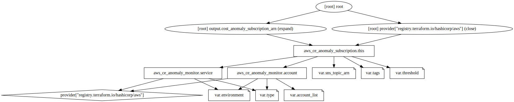

# Terraform AWS Cost Anomaly Monitor

A Terraform module to create an AWS Cost Anomaly Monitor.

## Pre-requisites

To use this module, you need to ensure the SNS topic you pass contains this statement in it's policy:

```hcl
data "aws_iam_policy_document" "sns_topic_policy" {
  policy_id = "sns_topic_policy"

  statement {
    sid = "AWSAnomalyDetectionSNSPublishingPermission"

    actions = [
      "SNS:Publish",
    ]

    principals {
      type        = "Service"
      identifiers = ["costalerts.amazonaws.com"]
    }

    resources = [
      aws_sns_topic.example.arn,
    ]
  }
}
```

## Usage

### Service

For monintoring spend per provisioned AWS service

```hcl
module "example" {
    source = "github.com/synapsestudios/terraform-aws-cost-anomaly-monitor"

    threshold = "10"
    environment = "production"
    sns_topic_arn = aws_sns_topic.example.arn

    tags = {
        "ProvisionedBy" = "terraform"
        "Environment"   = "production"
        "Module"        = "terraform-aws-cost-explorer-anomaly-monitor"
    }
}
```

### Account

For monitoring total account spend.

```hcl
module "example" {
    source = "github.com/synapsestudios/terraform-aws-cost-anomaly-monitor"

    threshold = "5"
    environment = "production"
    sns_topic_arn = aws_sns_topic.example.arn
    type = "account"
    account_list ["012345678901", "012345678901"]

    tags = {
        "ProvisionedBy" = "terraform"
        "Environment"   = "production"
        "Module"        = "terraform-aws-cost-explorer-anomaly-monitor"
    }
}
```

## Resource Graph



<!-- BEGIN_TF_DOCS -->
## Requirements

No requirements.

## Providers

| Name | Version |
|------|---------|
| <a name="provider_aws"></a> [aws](#provider\_aws) | n/a |

## Modules

No modules.

## Resources

| Name | Type |
|------|------|
| [aws_ce_anomaly_monitor.account](https://registry.terraform.io/providers/hashicorp/aws/latest/docs/resources/ce_anomaly_monitor) | resource |
| [aws_ce_anomaly_monitor.service](https://registry.terraform.io/providers/hashicorp/aws/latest/docs/resources/ce_anomaly_monitor) | resource |
| [aws_ce_anomaly_subscription.this](https://registry.terraform.io/providers/hashicorp/aws/latest/docs/resources/ce_anomaly_subscription) | resource |

## Inputs

| Name | Description | Type | Default | Required |
|------|-------------|------|---------|:--------:|
| <a name="input_account_list"></a> [account\_list](#input\_account\_list) | List of AWS account numbers to monitor for cost anomalies. Required if using "type" argument | `list(string)` | `[]` | no |
| <a name="input_environment"></a> [environment](#input\_environment) | The environment this module is being deployed to | `string` | `"dev"` | no |
| <a name="input_sns_topic_arn"></a> [sns\_topic\_arn](#input\_sns\_topic\_arn) | The ARN of the SNS topic to send notifications to | `string` | n/a | yes |
| <a name="input_tags"></a> [tags](#input\_tags) | Tags to apply to all resources created, see internal documentation for tagging standards | `map(string)` | <pre>{<br>  "Environment": "dev",<br>  "Module": "terraform-aws-cost-explorer-anomaly-monitor",<br>  "ProvisionedBy": "terraform"<br>}</pre> | no |
| <a name="input_threshold"></a> [threshold](#input\_threshold) | Value between 0 and 100 representing the percentage of impact to trigger an alert | `string` | `"10"` | no |
| <a name="input_type"></a> [type](#input\_type) | The type of anomaly to detect for. Requires "account\_list" argument. You won't be able to create a linked account monitor using this method from the linked account, the resource must be created in the parent account. | `string` | `"service"` | no |

## Outputs

| Name | Description |
|------|-------------|
| <a name="output_cost_anomaly_subscription_arn"></a> [cost\_anomaly\_subscription\_arn](#output\_cost\_anomaly\_subscription\_arn) | n/a |
<!-- END_TF_DOCS -->
